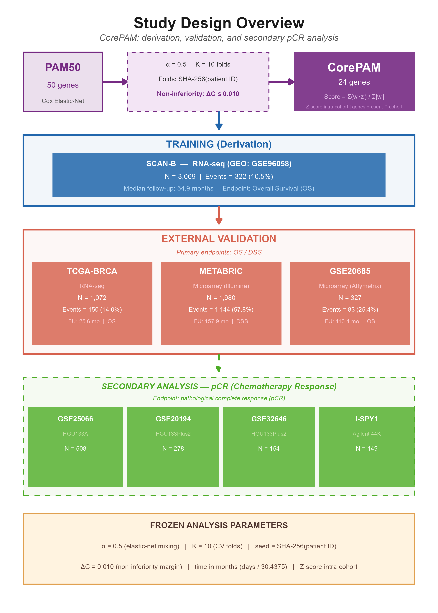
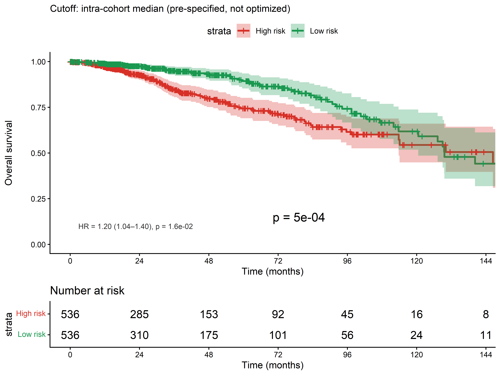
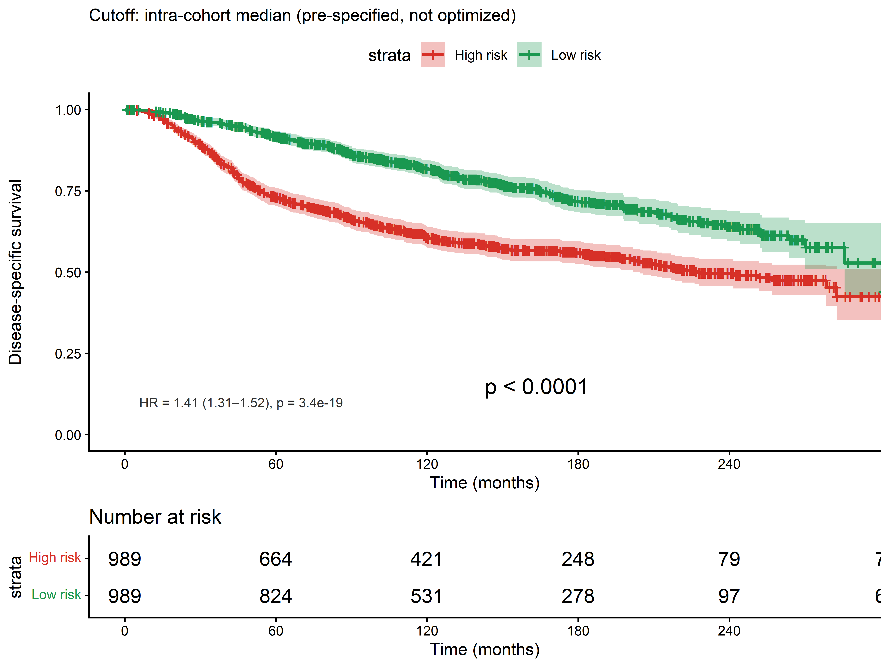
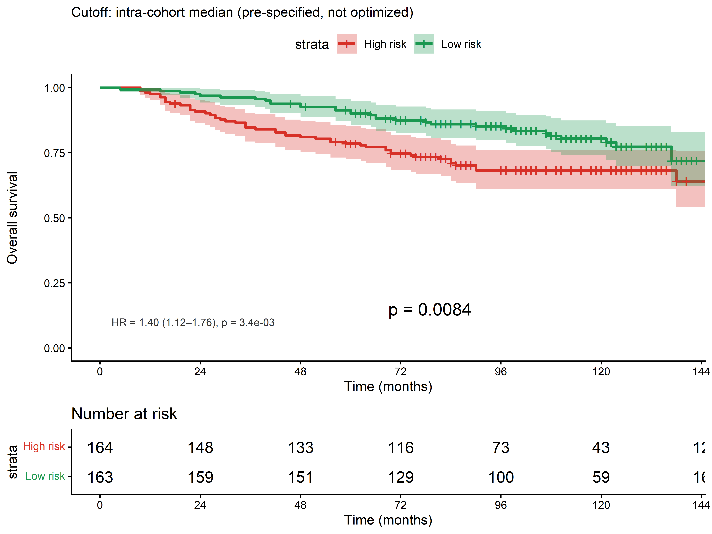
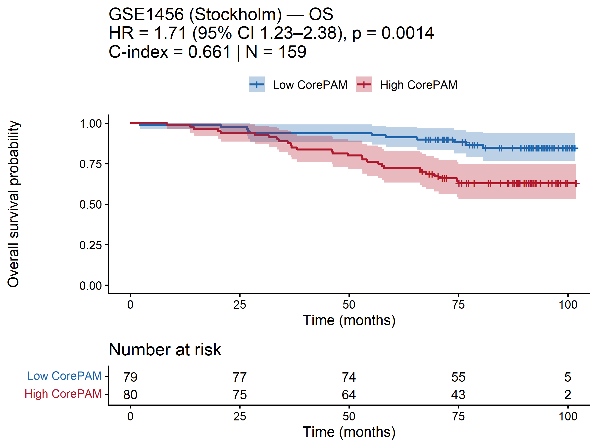
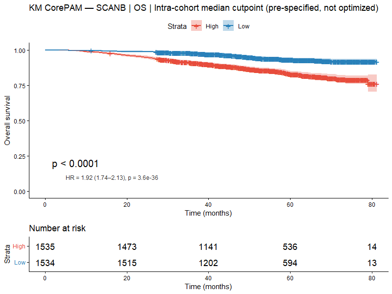
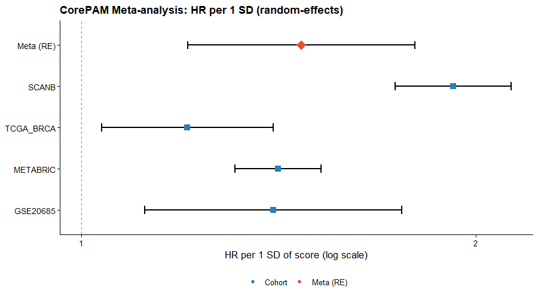
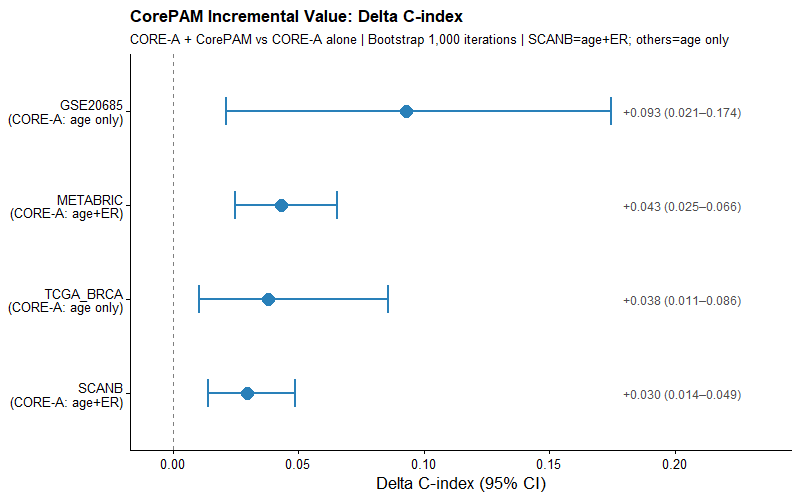
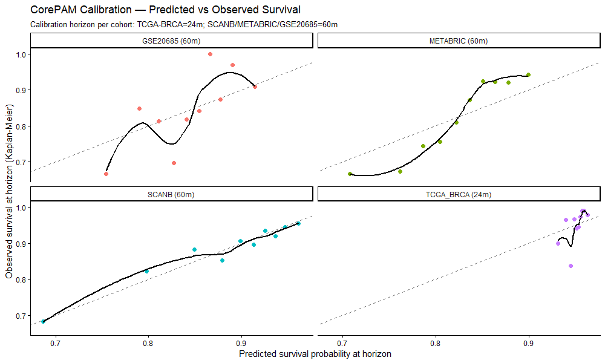
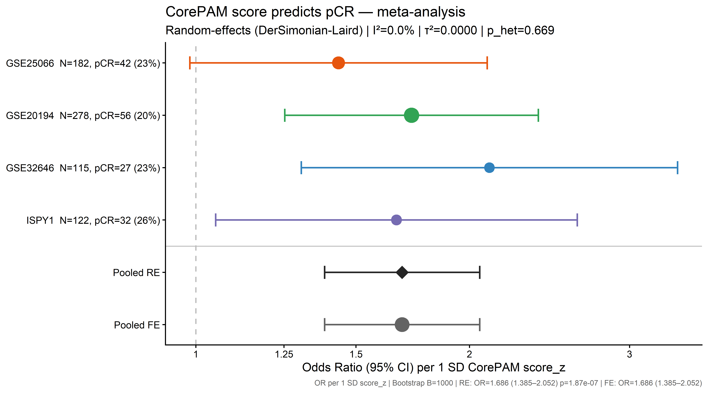

# CorePAM: a PAM50-derived gene expression score with multi-cohort external validation for breast cancer prognosis and neoadjuvant pCR across RNA-seq and microarray platforms

Rafael de Negreiros Botan^1\*^, João Batista de Sousa^2^

^1^ Department of Oncology, Universidade de Brasilia -- Brasilia, Brazil

^2^ Department of Proctology, Universidade de Brasilia -- Brasilia, Brazil

\*Corresponding author: Rafael de Negreiros Botan -- oncologista\@gmail.com

```{=openxml}
<w:p><w:r><w:br w:type="page"/></w:r></w:p>
```

# Abstract

**Background:** The PAM50 classifier predicts breast cancer prognosis but requires 50 genes and specialised platforms. We derived CorePAM, the smallest data-driven PAM50 subset maintaining non-inferior prognostic performance relative to a full 50-gene Cox elastic-net model, without pre-specifying gene count.

**Methods:** Cox elastic-net regression (alpha = 0.5) with deterministic 10-fold cross-validation was applied in the SCAN-B cohort (N = 3,069; GSE96058). Gene selection followed a pre-specified non-inferiority margin (delta C-index = 0.010). External validation used four independent cohorts: TCGA-BRCA (N = 1,072; RNA-seq), METABRIC (N = 1,978; microarray; disease-specific survival), GSE20685 (N = 327; microarray), and GSE1456 (N = 159; microarray). Incremental value over a clinical model (CORE-A: age and ER status) was assessed by bootstrap delta-C-index. Secondary analyses evaluated pathologic complete response (pCR) prediction in four neoadjuvant cohorts (N = 697) plus I-SPY2 (N = 986).

**Results:** CorePAM comprises 24 genes with an out-of-fold C-index of 0.670 (gap vs 50-gene maximum: 0.009). The score was independently associated with survival in all validation cohorts: TCGA-BRCA (HR = 1.20), METABRIC DSS (HR = 1.41), GSE20685 (HR = 1.40), GSE1456 (HR = 1.71); all p < 0.02. Random-effects meta-analysis (K = 4) yielded pooled HR = 1.37 (95% CI 1.24--1.52; I^2^ = 38.3%; p = 1.8 x 10^-9^). CorePAM provided incremental value beyond CORE-A and remained significant after adjustment for T-stage and nodal status. For pCR, pooled OR = 1.69 (95% CI 1.39--2.05; I^2^ = 0%; p = 1.9 x 10^-7^).

**Conclusions:** CorePAM -- a 24-gene PAM50-derived score -- achieves non-inferior discrimination relative to a 50-gene Cox elastic-net model across four validation cohorts spanning RNA-seq and microarray platforms, remains significant after anatomical staging adjustment, and predicts pCR. This reduction from 50 to 24 genes may facilitate implementation in resource-limited settings.

**Trial registration:** Not applicable.

**Keywords:** Breast cancer; Gene expression; Prognostic signature; PAM50; Elastic-net regression; Survival analysis; Pathologic complete response; Cross-platform validation

# Background

The PAM50 intrinsic subtype gene expression test classifies breast tumours into five molecular subtypes -- Luminal A, Luminal B, HER2-enriched, Basal-like, and Normal-like -- and underpins the Prosigna prognostic assay [1]. Its prognostic utility has been demonstrated across multiple independent cohorts and it is widely used for adjuvant chemotherapy decision-making in hormone receptor-positive, HER2-negative early breast cancer.

Despite its clinical validation, PAM50 requires simultaneous measurement of all 50 genes with calibrated reference samples. Its commercial implementation (Prosigna assay) is analytically validated exclusively on the NanoString nCounter platform [2], with substantial per-sample costs. These requirements create barriers in settings where RNA quality is limited (e.g., formalin-fixed paraffin-embedded tissue), platforms are unavailable, or per-sample costs are prohibitive. A reduced panel measurable by targeted RT-PCR or small targeted RNA-seq assays could extend the reach of molecular stratification to resource-limited settings.

Previous attempts to reduce gene panels have typically pre-specified the target gene count before analysis, selected genes by threshold on univariate statistics, or used cohorts that mixed RNA-seq and microarray expression without platform-specific preprocessing. These approaches either introduce analytical circularity (optimising for the assumed answer) or ignore the multi-platform generalizability that clinical deployment demands.

We present CorePAM, a data-driven reduction of the PAM50 gene set derived from the complete SCAN-B RNA-seq cohort (N = 3,069) using elastic-net Cox regression with deterministic cross-validation and a pre-specified non-inferiority criterion relative to a full 50-gene Cox elastic-net model. Critically, the gene count was not pre-specified: it was derived entirely from the data and the pre-registered delta-C-index = 0.010 non-inferiority boundary. Validation was performed across four independent cohorts spanning one RNA-seq and three microarray platforms, including the largest publicly available microarray breast cancer cohort (METABRIC, N = 1,978). We further assessed whether CorePAM predicts pathologic complete response (pCR) to neoadjuvant chemotherapy -- a clinical endpoint entirely distinct from the derivation analysis -- in four independent neoadjuvant cohorts and the large I-SPY2 platform trial.

# Methods

## Study design

This is a retrospective multicohort study exclusively using publicly available de-identified data. No new data were collected. All analytical parameters were pre-specified and frozen before any analysis (see Analytical Freeze).

## Cohorts

**Discovery cohort:** SCAN-B (GSE96058; N = 3,069 primary operable breast cancers) [3, 4] provided RNA-seq data (Illumina paired-end sequencing) with matched clinical follow-up. All SCAN-B samples with eligible data were used for model development; no predefined training/validation split was provided in the public metadata.

**Validation cohorts (OS/DSS block):**

- *TCGA-BRCA* (N = 1,072) [5]: RNA-seq (STAR aligner; GDC release); primary endpoint overall survival (OS).
- *METABRIC* (N = 1,978; cBioPortal) [6]: Illumina HT-12 microarray; primary endpoint disease-specific survival (DSS). Deaths from other causes were censored at time of death. OS was assessed as a sensitivity analysis.
- *GSE20685* (N = 327) [7]: Affymetrix HGU133A microarray; primary endpoint OS.
- *GSE1456* (N = 159; Stockholm cohort) [8]: Affymetrix HGU133A/B microarray; primary endpoint OS. Clinical covariates (age, ER status) were not available in the public annotation; CORE-A adjustment was not performed for this cohort.

**pCR block cohorts (secondary analysis, independent of OS block):**

- GSE25066 (N = 508) [9], GSE20194 (N = 278) [10], GSE32646 (N = 154) [11], I-SPY1/GSE22226 (N = 149) [12]: GEO microarray cohorts with pCR data from neoadjuvant chemotherapy trials. After applying eligibility criteria (available pCR outcome and expression data for CorePAM genes), 697 samples were included in the primary pCR analysis.
- I-SPY2/GSE194040 (N = 986) [13]: exploratory external cohort; pre-treatment RNA-seq biopsies; multi-arm neoadjuvant trial; batch-corrected by the original consortium using ComBat.

All cohorts underwent independent harmonisation; no expression or clinical data were pooled across cohorts.

## Analytical freeze

The following parameters were pre-specified and frozen before any analysis was performed, archived in the study repository (Table 1).

Table 1: CorePAM derivation parameters and frozen analytical settings.

| Parameter | Value |
|:---|:---|
| Non-inferiority margin (delta-C-index) | 0.010 |
| Elastic-net mixing parameter (alpha) | 0.5 |
| Cross-validation folds (K) | 10 |
| Fold assignment | Deterministic (SHA-256 of patient ID) |
| Minimum gene coverage (validation) | 80% |
| Time unit | months (days / 30.4375) |
| Gene count | Not pre-specified (derived from data) |

## Expression preprocessing

All preprocessing was performed independently per cohort with no inter-cohort pooling or batch correction.

*RNA-seq cohorts (SCAN-B, TCGA-BRCA):* Raw counts were filtered with edgeR::filterByExpr, normalised by TMM, and transformed to log-CPM (prior.count = 1). Ensembl identifiers were mapped to official HGNC symbols via org.Hs.eg.db (offline annotation). In the case of multiple Ensembl IDs mapping to the same HGNC symbol, the identifier with the highest intra-cohort variance was retained.

*Microarray cohorts (METABRIC, GSE20685, GSE1456):* Log2-scaled intensities from GEO Series Matrix files (pre-processed by the original data submitters) were used without additional normalisation. METABRIC identifiers were mapped via org.Hs.eg.db; GSE20685 and GSE1456 (Affymetrix HGU133A/B) via hgu133a.db. Six PAM50 genes lack probes on HGU133A (platform ceiling: 44/50 = 88%, above the 80% minimum); of these, two belong to the CorePAM panel in GSE20685 (GPR160, CXXC5; 22/24 = 91.7%) and three in GSE1456 (GPR160, CXXC5, KRT17; 21/24 = 87.5%), both above the 80% minimum. METABRIC ER status was obtained from the cBioPortal clinical file (ER_IHC column).

*Score completeness:* When fewer than 24 CorePAM genes are available (e.g., GSE20685: 22/24 genes, 91.7%), the score is computed over available genes only, with the denominator renormalised accordingly. Gene coverage is reported per cohort (Table 2); the pre-specified minimum of 80% was met in all cases. Sensitivity to missing genes is further assessed in a leave-one-gene-out analysis (Additional file 9: Figure S9).

Table 2: CorePAM gene coverage by validation cohort.

| Cohort | Platform | Genes present | Coverage (%) | Missing genes |
|:---|:---|:---:|:---:|:---|
| SCAN-B | RNA-seq (Illumina) | 24/24 | 100 | -- |
| TCGA-BRCA | RNA-seq (STAR/GDC) | 23/24 | 95.8 | MIA |
| METABRIC | Illumina HT-12 microarray | 24/24 | 100 | -- |
| GSE20685 | Affymetrix HGU133A | 22/24 | 91.7 | GPR160, CXXC5 |
| GSE1456 | Affymetrix HGU133A/B | 21/24 | 87.5 | GPR160, CXXC5, KRT17 |

## CorePAM derivation

Cox elastic-net regression (alpha = 0.5 [14]; glmnet package) was fitted in SCAN-B using a 10-fold cross-validation scheme. Fold assignment was *deterministic*, based on the first eight hexadecimal digits of the SHA-256 hash of each patient identifier, with event-stratification. This deterministic fold assignment ensures exact reproducibility from first principles without dependence on a random seed as driver of gene selection.

Out-of-fold (OOF) C-index was computed for each degree-of-freedom level (df = number of non-zero genes) along the regularisation path. CorePAM was defined as the *smallest df* satisfying: C~adj~(df) >= C~adj,max~ -- 0.010. The non-inferiority margin of 0.010 was chosen because it is less than half of one approximate standard error of the OOF C-index in the training cohort (SE approximately 0.026 for N = 3,069 with 322 events), representing a clinically negligible loss in discrimination. Sensitivity analysis confirmed robustness: margins of 0.005, 0.015, and 0.020 would have selected 31, 18, and 16 genes respectively, demonstrating that the selected panel is not brittle to the choice of margin. Final model coefficients were extracted from the full-data path at the selected lambda.

## Score calculation

For each cohort, the CorePAM score was computed as:

score = SUM(w~i~ · z~i~) / SUM(|w~i~|)

where z~i~ is the intra-cohort z-score of gene *i* and w~i~ is its weight from the frozen model, and G~present~ is the set of CorePAM genes available in that cohort. The score was subsequently standardised intra-cohort (score_z = scale(score)) for proportional hazards regression, yielding hazard ratios per 1 SD. Score direction (positive = higher risk) was established in the SCAN-B training cohort (training HR = 1.92, confirming positive orientation); the same directional convention was confirmed to hold in all four external validation cohorts (all univariate HRs > 1) without requiring sign inversion in any cohort.

## Survival analysis

**Univariate Cox:** score_z as the sole predictor; HR per 1 SD with Wald confidence intervals.

**Multivariate Cox (CORE-A model):** score_z adjusted for age (continuous) and ER status (binary), when ER was available in harmonised clinical data. CORE-A covariates by cohort: SCAN-B -- age + ER status; METABRIC -- age + ER status; TCGA-BRCA -- age alone (ER status was not recoverable from the GDC-harmonised clinical file); GSE20685 -- age alone (ER status absent from the GSE Series Matrix clinical annotation). CORE-A denotes the clinical-only model (age +/- ER).

**C-index:** Harrell's C-index [15] with 95% bootstrap CI (B = 1,000).

**Kaplan-Meier:** dichotomised at the intra-cohort median; log-rank test. Quartile sensitivity analysis.

**Fine-Gray competing risks:** applied to METABRIC DSS (deaths from other causes as competing event; Additional file 5: Figure S5).

**Incremental value:** delta-C-index = C(CORE-A + score_z) -- C(CORE-A); bootstrap 95% CI (B = 1,000).

**Meta-analysis:** Random-effects model using REML estimator for the OS/DSS block; DerSimonian-Laird for the pCR block (metafor package [16]). Four independent validation cohorts were included (K = 4: TCGA-BRCA, METABRIC, GSE20685, GSE1456); SCAN-B excluded as training cohort. Hartung-Knapp adjustment [17] applied as sensitivity analysis.

**Decision curve analysis (DCA):** Net benefit at clinically relevant probability thresholds using dcurves::dca (OS: 60 month horizon for SCAN-B, METABRIC, GSE20685; 24 months for TCGA-BRCA).

**Clinical baseline model scope:** CORE-A was pre-specified as the minimum clinical baseline (age and ER status) for consistency across cohorts, avoiding post-hoc covariate selection decisions. T-stage and nodal status were reserved for exploratory sensitivity analyses (Additional file 13: Table S3), as their harmonisation quality varied across public data sources and their inclusion in the primary model would have introduced cohort-specific modelling decisions incompatible with a uniform validation framework.

## pCR analysis

Logistic regression: pCR ~ score_z (univariate); adjusted for age and ER/HER2 status where available. OR per 1 SD with Wald CI. AUC by DeLong method. Bootstrap CI (B = 1,000, seed = 42). I-SPY2 sensitivity analysis restricted to the paclitaxel control arm (N = 179).

## Quality control

Comprehensive QC comprised: (i) off-diagonal score correlation between cohorts via percentile-based Spearman rho (Additional file 3: Figure S3); (ii) forensic PCA of METABRIC expression for batch effects and outliers (Additional file 4: Figure S4); (iii) schema/range hard-checks on all analysis-ready files; (iv) automated anti-hardcoding assertions verifying all reported values against source CSV/JSON files. Full gene coverage details per cohort and platform are provided in Additional file 12: Table S2.

## Data and code availability

All raw data are publicly available (GEO, GDC, cBioPortal). Analysis code is available at https://github.com/RafaelBotan/CorePAM-Study [18]. All results are reproducible from the repository.

## Computational assistance

A large language model (Claude, Anthropic) was used as a coding assistant for directory organisation, script development, and manuscript formatting. All code was reviewed and validated by the authors before use.

## Statistical software

R version 4.5.2. Key packages: glmnet (elastic-net), survival/survminer (Cox, KM), metafor (meta-analysis), dcurves (DCA), edgeR (RNA-seq normalisation).

# Results

## CorePAM derivation

The study design and validation pipeline are summarised in Figure 1. Out-of-fold Cox elastic-net regression in SCAN-B identified 24 genes as the minimum set satisfying the pre-specified non-inferiority criterion (delta-C = 0.010). The selected model achieved an OOF C-index of 0.670, compared to the maximum OOF C-index achievable with all 50 PAM50 candidates (0.679), with a gap of 0.009 -- within the 0.010 boundary. The selected 24 genes and their elastic-net Cox weights are illustrated in Additional file 2: Figure S2 and listed in Additional file 11: Table S1.

{width=6in}

The 24 genes span luminal differentiation (ESR1, PGR, NAT1), proliferation (MYBL2, PTTG1, EXO1, MYC), basal phenotype (KRT5, KRT17, FOXC1), and HER2-enriched markers (ERBB2, GRB7, MIA), with full gene list in Additional file 11: Table S1. The Pareto frontier (Additional file 1: Figure S1) shows diminishing returns beyond approximately 15 genes, with the non-inferiority boundary crossed at df = 24. Bootstrap resampling (B = 200) confirmed that 15 of 24 CorePAM genes were selected in at least 70% of resamples, with a minimum selection frequency of 35.5% (Additional file 8: Figure S8).

## Prognostic validation

The CorePAM score was independently associated with survival in all four external validation cohorts (Table 3). In TCGA-BRCA (RNA-seq), HR per 1 SD = 1.20 (95% CI 1.04--1.40; p = 0.016). In METABRIC (DSS endpoint; Illumina microarray), HR = 1.41 (95% CI 1.31--1.52; p < 0.001). In GSE20685 (Affymetrix microarray), HR = 1.40 (95% CI 1.12--1.76; p = 0.003). In GSE1456 (Stockholm; Affymetrix microarray), HR = 1.71 (95% CI 1.23--2.38; p = 0.001). Kaplan-Meier curves stratified at the intra-cohort median score are shown in Figure 2.

Table 3: CorePAM prognostic performance across cohorts.

| Cohort | Role | Endpoint | N | Events | FU (mo) | HR uni (95% CI) | p | C-index (95% CI) | HR adj | p adj |
|:---|:---|:---:|:---:|:---:|:---:|:---|:---:|:---|:---|:---:|
| SCAN-B | Training^a^ | OS | 3,069 | 322 | 55.7 | 1.92 (1.74--2.13) | <0.001 | 0.698 (0.668--0.729) | 1.86 (1.64--2.12) | <0.001 |
| TCGA-BRCA | Validation | OS | 1,072 | 150 | 32.0 | 1.20 (1.04--1.40) | 0.016 | 0.624 (0.572--0.678) | 1.27 (1.09--1.48) | 0.002 |
| METABRIC | Validation | DSS | 1,978 | 646 | 159 | 1.41 (1.31--1.52) | <0.001 | 0.638 (0.615--0.659) | 1.36 (1.24--1.48) | <0.001 |
| GSE20685 | Validation | OS | 327 | 83 | 112.8 | 1.40 (1.12--1.76) | 0.003 | 0.623 (0.562--0.683) | 1.40 (1.12--1.76) | 0.003 |
| GSE1456 | Validation | OS | 159 | 40 | 91.1 | 1.71 (1.23--2.38) | 0.001 | 0.661 (0.582--0.741) | 1.71 (1.23--2.38)^b^ | 0.001 |

^a^ C-index shown is in-sample (0.698); OOF C-index = 0.670. ^b^ CORE-A adjustment not performed (clinical covariates unavailable); univariate HR shown. HR: hazard ratio per 1 SD; CI: confidence interval; FU: median follow-up in censored patients; adj: adjusted for CORE-A (age +/- ER status).

{width=6in}

{width=6in}

{width=6in}

{width=6in}

TCGA-BRCA has shorter follow-up (median 32 months), attenuating the HR; a 24-month sensitivity analysis yielded HR = 1.64 (95% CI 1.24--2.16; p = 4.7 x 10^-4^; Additional file 6: Figure S6).

Multivariate Cox regression including the CORE-A clinical model (age and ER status where available) yielded adjusted HRs of 1.27 (TCGA-BRCA), 1.36 (METABRIC), and 1.40 (GSE20685), indicating that CorePAM provides prognostic information independent of clinical covariates. GSE1456 lacked clinical covariates for CORE-A adjustment; the univariate HR of 1.71 nonetheless confirms cross-platform generalizability on an independent Affymetrix dataset. The training cohort Kaplan-Meier curve is shown in Figure 3 (in-sample C-index = 0.698; OOF C-index = 0.670).

{width=6in}

## Meta-analysis

Random-effects meta-analysis across four validation cohorts yielded a pooled HR of 1.37 (95% CI 1.24--1.52; p = 1.8 x 10^-9^) with moderate heterogeneity (I^2^ = 38.3%; Figure 4). The Hartung-Knapp sensitivity analysis confirmed significance under conservative inference (Table 4). OS-harmonised and leave-one-out sensitivity analyses maintained consistent positive direction.

{width=6in}

Table 4: Random-effects meta-analysis of CorePAM prognostic association (K = 4 validation cohorts).

| Analysis | HR (95% CI) | p | I^2^ |
|:---|:---|:---:|:---:|
| Primary RE (REML) | 1.37 (1.24--1.52) | 1.8 x 10^-9^ | 38.3% |
| Hartung-Knapp | 1.37 (1.15--1.64) | 0.011 | 38.3% |
| OS-harmonised | 1.36 (1.13--1.64) | <0.001 | 50.5% |

## Incremental value beyond clinical predictors

The CorePAM score improved the C-index over the CORE-A clinical model in all four cohorts (Table 5). CORE-A covariates were: age and ER status in SCAN-B and METABRIC; age alone in TCGA-BRCA and GSE20685 (where ER status was absent from harmonised clinical files). The largest increment was observed in GSE20685 (delta-C = +0.093), consistent with the long follow-up and high event rate in that cohort (Figure 5A). Calibration at clinically relevant horizons showed adequate concordance between predicted and observed event rates in the training cohort, with expected under-confidence in external validation cohorts (Figure 5B). Decision curve analysis confirmed net clinical benefit across a range of probability thresholds in all cohorts (Additional file 7: Figure S7). Sensitivity analysis comparing age-only versus age + ER baselines confirmed that the CorePAM HR remains significant under both definitions (Additional file 10: Figure S10).

Table 5: Incremental C-index of CorePAM score over the CORE-A clinical model.

| Cohort | CORE-A covariates | N | C (CORE-A) | C (CORE-A + CorePAM) | Delta-C (95% CI) |
|:---|:---|:---:|:---:|:---:|:---|
| SCAN-B | age + ER | 3,069 | 0.750 | 0.780 | +0.030 (0.014--0.049) |
| TCGA-BRCA | age | 1,072 | 0.638 | 0.676 | +0.038 (0.011--0.086) |
| METABRIC | age + ER | 1,978 | 0.603 | 0.646 | +0.043 (0.025--0.066) |
| GSE20685 | age | 327 | 0.536 | 0.628 | +0.093 (0.021--0.175) |

{width=6in}

{width=6in}

## Independence from anatomical staging

To address whether CorePAM retains prognostic value after adjustment for standard clinical-pathological variables, we fitted expanded multivariable Cox models adjusting for age, ER status (where available), pathological T-stage, and nodal status. T-stage and nodal status were available in 96--100% of samples across the four cohorts with clinical covariates (SCAN-B, TCGA-BRCA, METABRIC, GSE20685). CorePAM remained independently significant in all four (all p < 0.002; Additional file 13: Table S3), with HR attenuation of less than 10% compared to the primary CORE-A baseline. Adding CorePAM to the expanded clinical model increased the C-index by +0.022 to +0.027.

## Pathologic complete response (secondary analysis)

In four independent neoadjuvant cohorts (N = 697 total), the CorePAM score was consistently associated with higher pCR rates (Table 6). The direction of effect was positive in all four cohorts, with ORs ranging from 1.44 to 2.10 per 1 SD. The AUC ranged from 0.576 to 0.716, indicating moderate to good discriminative ability for pCR prediction.

Table 6: CorePAM score predicts pCR in neoadjuvant chemotherapy cohorts.

| Cohort | N | pCR, n (%) | OR per 1 SD (95% CI) | p | AUC (95% CI) |
|:---|:---:|:---|:---|:---:|:---|
| GSE25066 | 182 | 42 (23.1%) | 1.44 (0.98--2.09) | 0.060 | 0.576 (0.477--0.676) |
| GSE20194 | 278 | 56 (20.1%) | 1.73 (1.25--2.38) | <0.001 | 0.660 (0.586--0.734) |
| GSE32646 | 115 | 27 (23.5%) | 2.10 (1.31--3.39) | 0.002 | 0.716 (0.611--0.821) |
| I-SPY1 | 122 | 32 (26.2%) | 1.66 (1.05--2.63) | 0.030 | 0.622 (0.517--0.726) |
| **RE pooled** | **697** | | **1.69 (1.39--2.05)** | **<0.001** | |

OR: odds ratio per 1 SD CorePAM score; AUC: area under the receiver operating characteristic curve; RE: random effects (DerSimonian-Laird). I^2^ = 0%.

Random-effects meta-analysis yielded a pooled OR of 1.69 (95% CI 1.39--2.05; I^2^ = 0%; p = 1.9 x 10^-7^; Figure 6). The absence of heterogeneity across four cohorts from different platforms and trials reinforces the cross-platform consistency of the CorePAM pCR association.

{width=6in}

**I-SPY2 exploratory analysis.** In the I-SPY2 external exploratory cohort (GSE194040; N = 986; pCR rate = 32.4%), the CorePAM score predicted pCR univariately (OR = 1.68; 95% CI 1.45--1.95; AUC = 0.648). Inclusion of I-SPY2 in the meta-analysis (k = 5) yielded OR = 1.69 (95% CI 1.50--1.90; I^2^ = 0%), virtually identical to the primary analysis, confirming external generalizability.

# Discussion

We demonstrate that CorePAM -- a 24-gene data-driven reduction of the PAM50 panel -- achieves non-inferior prognostic performance relative to a full 50-gene Cox elastic-net model in four independent external cohorts spanning RNA-seq and microarray platforms. The comparator is a 50-gene Cox elastic-net model, not the commercial Prosigna/PAM50 assay (which uses centroid-based subtyping plus ROR); the non-inferiority claim is scoped to this elastic-net framework. No claims of therapeutic equivalence or clinical decision-making impact are made.

**Reproducible derivation.** Fold assignment was deterministic (SHA-256 of patient identifiers), eliminating random seeds as a driver of gene selection and ensuring exact reproducibility from first principles. The gene count (N = 24) was not pre-specified; it was derived from the Pareto frontier of model complexity versus OOF C-index (Additional file 1: Figure S1), where performance plateaus well before 50 genes.

**Gene selection stability.** Bootstrap resampling (B = 200 refits on SCAN-B) confirmed that 15 of 24 CorePAM genes were selected in at least 70% of resamples (Additional file 8: Figure S8), with 2 genes (ACTR3B, NAT1) selected in 100%. The remaining genes show lower but non-negligible selection frequencies (minimum: 35.5%), consistent with the elastic-net grouping property that distributes weight among correlated genes. Leave-one-gene-out analysis showed that no single gene removal causes catastrophic performance loss (Additional file 9: Figure S9; maximum |delta-C| = 0.044).

**Heterogeneity is expected and informative.** The moderate I^2^ in the OS/DSS meta-analysis reflects two structural sources: endpoint divergence (DSS in METABRIC vs. OS in the other cohorts) and differential follow-up duration (32 months in TCGA-BRCA vs. 91--159 months elsewhere). The OS-harmonised sensitivity analysis (substituting METABRIC OS for DSS) reduced I^2^ substantially, confirming the pooled estimate is not driven by endpoint choice. The key finding is the consistency of *direction* -- a positive HR in all four validation cohorts -- rather than effect magnitude. The Hartung-Knapp sensitivity analysis confirmed significance under conservative inference.

**Biological coherence.** The retained genes recapitulate core PAM50 biology: luminal differentiation (ESR1, PGR, BCL2, NAT1), proliferation (MYBL2, PTTG1, EXO1, MYC), basal phenotype (KRT5, KRT17, FOXC1), and HER2-enriched markers (ERBB2, GRB7). The proliferation genes also explain the pCR signal, as these pathways are targeted by anthracycline-taxane regimens. The 26 excluded genes received zero weight across the regularisation path, consistent with functional redundancy under the elastic-net grouping property.

**Cross-platform consistency in pCR prediction.** The pCR block showed no heterogeneity (I^2^ = 0% across four cohorts), consistent with the biological basis of the signal: the retained proliferation genes are directly targeted by standard neoadjuvant regimens.

**Calibration and clinical utility.** Calibration at clinically relevant horizons (60 months for SCAN-B, METABRIC, GSE20685; 24 months for TCGA-BRCA) showed adequate concordance between predicted and observed event rates in the training cohort (Figure 5B). In external validation cohorts, the observed risk stratification exceeded the predicted range, consistent with model under-confidence when applying scores cross-platform without recalibration -- a structural property of intra-cohort z-scoring. Decision curve analysis confirmed positive net benefit across a range of probability thresholds in all cohorts (Additional file 7: Figure S7).

**Independence from anatomical staging.** An exploratory sensitivity analysis adjusting for pathological T-stage and nodal status -- the key clinical-pathological confounders not included in the primary CORE-A baseline -- confirmed that CorePAM retains independent prognostic value in all four cohorts (Additional file 13: Table S3). The HR attenuation was less than 10%, and the incremental C-index remained positive (+0.022 to +0.027). This does not alter the primary endpoint or replace the main analyses; it corroborates robustness against pathological confounding.

**Comparison with established signatures.** An exploratory head-to-head comparison against research-based implementations (genefu R package) of the PAM50-derived Risk of Recurrence score (ROR-S, 50 genes) and the OncotypeDX Recurrence Score (ODX-RS, 21 genes) showed that CorePAM (24 genes) performs competitively (Additional file 14: Table S4). CorePAM showed advantages in the RNA-seq cohorts (its training domain) and small deficits (delta-C < 0.03) in the microarray cohorts (the development domain of those signatures). This comparison involves research-based score implementations -- not commercial assays -- and should be interpreted as evidence of competitive performance, not clinical equivalence.

**Clinical implications.** A 24-gene panel can be measured by a variety of RT-PCR, NanoString nCounter, or targeted RNA-seq platforms that are unable to reliably quantify all 50 PAM50 genes. If validated in prospective cohorts, CorePAM could extend the reach of molecular stratification to resource-limited settings.

**Limitations.** This is a retrospective study using public data. TCGA-BRCA has structurally short follow-up (median 32 months), attenuating the detectable HR; the 24-month sensitivity analysis (Additional file 6: Figure S6) partially mitigates this. METABRIC uses DSS as the primary endpoint, following established precedent for that dataset. Two CorePAM genes are absent from the Affymetrix HGU133A platform used in GSE20685 (22/24 = 91.7% coverage); gene dropout sensitivity analysis confirmed minimal impact (Additional file 9: Figure S9). The primary CORE-A clinical baseline was restricted to age and ER status -- the two variables consistently available in harmonised form -- although expanded models including T-stage and nodal status confirmed independent prognostic value (Additional file 13: Table S3). ER status was unavailable in TCGA-BRCA and GSE20685, restricting CORE-A to age alone in those cohorts. Comparisons with ROR-S and ODX-RS used research-based implementations, not commercial assays. No prospective validation was performed. The current score formulation relies on intra-cohort z-score normalisation, which is appropriate for retrospective multi-cohort validation but does not directly support single-sample scoring in a clinical setting; clinical translation would require a fixed normalisation reference (e.g., platform-specific reference distributions or housekeeping-gene calibration), which is the subject of future technical validation work.

# Conclusions

CorePAM is a 24-gene data-driven reduction of the PAM50 panel, derived without pre-specifying gene count, that achieves non-inferior prognostic discrimination relative to a full 50-gene Cox elastic-net model across four independent validation cohorts and two distinct expression platforms (RNA-seq and microarray). The score provides incremental value beyond a clinical baseline model, remains independently significant after adjustment for anatomical staging (T-stage and nodal status), and predicts pathologic complete response to neoadjuvant chemotherapy with high cross-cohort consistency (I^2^ = 0%). The analytical pipeline is fully reproducible from publicly available data.

# List of abbreviations

AUC: Area under the curve
CI: Confidence interval
CORE-A: Clinical baseline model (age +/- ER status)
CPM: Counts per million
CV: Cross-validation
DCA: Decision curve analysis
DL: DerSimonian-Laird
DSS: Disease-specific survival
ER: Estrogen receptor
FFPE: Formalin-fixed paraffin-embedded
GDC: Genomic Data Commons
GEO: Gene Expression Omnibus
HER2: Human epidermal growth factor receptor 2
HGNC: HUGO Gene Nomenclature Committee
HR: Hazard ratio
KM: Kaplan-Meier
LLM: Large language model
OOF: Out-of-fold
OR: Odds ratio
OS: Overall survival
PAM50: Prediction Analysis of Microarray 50
PCA: Principal component analysis
pCR: Pathologic complete response
RE: Random effects
REML: Restricted maximum likelihood
ROR-S: Risk of Recurrence score (subtype-based)
SD: Standard deviation
SE: Standard error
TMM: Trimmed mean of M-values

# Declarations

## Ethics approval and consent to participate

Not applicable. This study uses exclusively publicly available de-identified data (GEO, GDC, cBioPortal). No new human subjects research was conducted.

## Consent for publication

Not applicable.

## Availability of data and materials

All raw data are available through GEO (GSE96058, GSE25066, GSE20194, GSE32646, GSE22226, GSE194040, GSE1456), GDC (TCGA-BRCA), and cBioPortal (METABRIC). Analysis code, frozen analytical parameters, and a single-command reproducibility script are available at https://github.com/RafaelBotan/CorePAM-Study [18] (release tagged at submission). All results can be reproduced from raw public data using the provided pipeline.

## Competing interests

The authors declare no competing interests.

## Funding

No external funding was received. This study was conducted independently by the author.

## Authors' contributions

RB designed the study, performed all analyses, and wrote the manuscript. JBS supervised the study and reviewed the manuscript. Both authors read and approved the final manuscript.

## Acknowledgements

The author thanks the SCAN-B, TCGA, METABRIC, I-SPY, and Stockholm (GSE1456) consortia for making their data publicly available.

# References

1. Parker JS, Mullins M, Cheang MCU, et al. Supervised risk predictor of breast cancer based on intrinsic subtypes. J Clin Oncol. 2009;27(8):1160--1167.
2. Nielsen TO, Balslev E, Muller S, et al. Analytical validation of the PAM50-based Prosigna Breast Cancer Prognostic Gene Signature Assay and nCounter Analysis System using formalin-fixed paraffin-embedded breast tumor specimens. BMC Cancer. 2014;14:177.
3. Brueffer C, Vallon-Christersson J, Grabau D, et al. Clinical value of RNA sequencing-based classifiers for prediction of the five conventional breast cancer biomarkers: a report from the population-based multicenter Sweden Cancerome Analysis Network -- Breast initiative. JCO Precis Oncol. 2018;2:1--18.
4. Saal LH, Vallon-Christersson J, Hakkinen J, et al. The Sweden Cancerome Analysis Network -- Breast (SCAN-B) Initiative: a large-scale multicenter infrastructure towards implementation of breast cancer genomic analyses in the clinical routine. Genome Med. 2015;7:20.
5. Cancer Genome Atlas Network. Comprehensive molecular portraits of human breast tumours. Nature. 2012;490(7418):61--70.
6. Curtis C, Shah SP, Chin SF, et al. The genomic and transcriptomic architecture of 2,000 breast tumours reveals novel subgroups. Nature. 2012;486(7403):346--352.
7. Kao KJ, Chang KM, Hsu HC, et al. Correlation of microarray-based breast cancer molecular subtypes and clinical outcomes: implications for treatment optimization. BMC Cancer. 2011;11:143.
8. Pawitan Y, Bjohle J, Amler L, et al. Gene expression profiling spares early breast cancer patients from adjuvant therapy: derived and validated in two population-based cohorts. Breast Cancer Res. 2005;7(6):R953--R964.
9. Hatzis C, Pusztai L, Valero V, et al. A genomic predictor of response and survival following taxane-anthracycline chemotherapy for invasive breast cancer. JAMA. 2011;305(18):1873--1881.
10. MAQC Consortium. The MicroArray Quality Control (MAQC)-II study of common practices for the development and validation of microarray-based predictive models. Nat Biotechnol. 2010;28(8):827--838.
11. Miyake T, Nakayama T, Naoi Y, et al. GSTP1 expression predicts poor pathological complete response to neoadjuvant chemotherapy in ER-negative breast cancer. Cancer Sci. 2012;103(5):913--920.
12. Esserman LJ, Berry DA, Cheang MCU, et al. Chemotherapy response and recurrence-free survival in neoadjuvant breast cancer depends on biomarker profiles: results from the I-SPY 1 TRIAL (CALGB 150007/150012; ACRIN 6657). Breast Cancer Res Treat. 2012;132(3):1049--1062.
13. Wolf DM, Yau C, Wulfkuhle J, et al. Redefining breast cancer subtypes to guide treatment prioritization and maximize response: predictive biomarkers across 10 cancer therapies. Cancer Cell. 2022;40(6):609--623.
14. Zou H, Hastie T. Regularization and variable selection via the elastic net. J R Stat Soc Ser B. 2005;67(2):301--320.
15. Harrell FE Jr, Califf RM, Pryor DB, et al. Evaluating the yield of medical tests. JAMA. 1982;247(18):2543--2546.
16. Viechtbauer W. Conducting meta-analyses in R with the metafor package. J Stat Softw. 2010;36(3):1--48.
17. Hartung J, Knapp G. A refined method for the meta-analysis of controlled clinical trials with binary outcome. Stat Med. 2001;20(24):3875--3889.
18. Botan RN. CorePAM-Study: CorePAM analytical pipeline. GitHub. https://github.com/RafaelBotan/CorePAM-Study. Accessed 2026.

# Additional files

**Additional file 1: Figure S1.** Pareto frontier: gene count vs. OOF C-index. Each point represents a unique df level along the glmnet regularisation path. Dashed red line: non-inferiority boundary (C~max~ minus 0.010). (PNG)

**Additional file 2: Figure S2.** CorePAM gene weights (lollipop plot). Elastic-net Cox regression coefficients. Positive weights (red): higher expression associated with worse survival. (PNG)

**Additional file 3: Figure S3.** Off-diagonal CorePAM score correlations between cohorts. Spearman rho computed on paired percentiles. (PNG)

**Additional file 4: Figure S4.** Forensic PCA of METABRIC expression matrix. Principal component analysis coloured by batch/platform annotation. (PNG)

**Additional file 5: Figure S5.** METABRIC sensitivity analyses. A: OS endpoint. B: Fine-Gray competing risks model. C: Quartile Kaplan-Meier (DSS). (PNG)

**Additional file 6: Figure S6.** TCGA-BRCA 24-month sensitivity analysis. (PNG)

**Additional file 7: Figure S7.** Decision curve analysis (OS). Net benefit versus treat-all and treat-none strategies. Horizons: 60 months (SCAN-B, METABRIC, GSE20685) and 24 months (TCGA-BRCA). (PNG)

**Additional file 8: Figure S8.** Bootstrap stability of CorePAM gene selection (B = 200). Frequency of each PAM50 gene across 200 bootstrap refits. (PNG)

**Additional file 9: Figure S9.** Leave-one-gene-out sensitivity analysis. Change in C-index when each CorePAM gene is individually removed. (PNG)

**Additional file 10: Figure S10.** CORE-A baseline sensitivity analysis. Forest plot comparing CorePAM adjusted HR under different clinical baselines. (PNG)

**Additional file 11: Table S1.** CorePAM gene list with elastic-net weights (24 genes). (CSV)

**Additional file 12: Table S2.** Gene coverage details by cohort and platform. (CSV)

**Additional file 13: Table S3.** Expanded CORE-A analysis: CorePAM independence from anatomical staging (T-stage, nodal status). (CSV)

**Additional file 14: Table S4.** Head-to-head C-index comparison: CorePAM vs research-based ROR-S and OncotypeDX-RS. (CSV)
